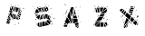

# commons-captcha  

A Java servlet for generating simple captcha images.

Unlike other Captcha generators, this generator asks the user to click on a certain character, instead of typing a text.

This software is part of the Shredzone Commons.

## Documentation

See the [online documentation](https://shredzone.org/maven/commons-captcha/).

## Contribute

* Fork the [Source code at Codeberg](https://codeberg.org/shred/commons-captcha). Feel free to send pull requests.
* Found a bug? [File a bug report!](https://codeberg.org/shred/commons-captcha/issues)

## License

_commons-captcha_ is open source software. The source code is distributed under the terms of [GNU Lesser General Public License Version 3](http://www.gnu.org/licenses/lgpl-3.0.html).
